## Shell Lab
2014-17831 (stu15) 김재원

### Results
- 이미지 좌측에는 `tsh` 실행 결과가, 우측에는 `tshref`의 실행 결과가 있습니다.

#### Trace 01
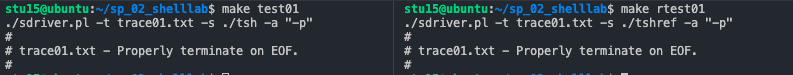

#### Trace 02
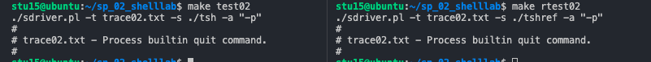

#### Trace 03
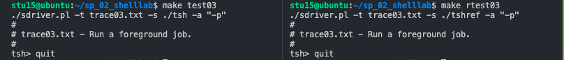

#### Trace 04
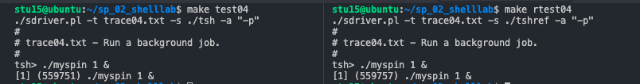

#### Trace 05
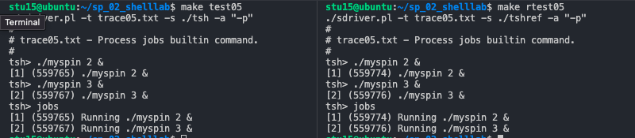

#### Trace 06
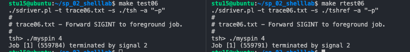

#### Trace 07
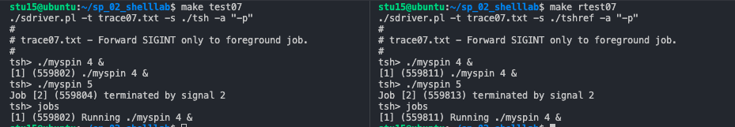

#### Trace 08
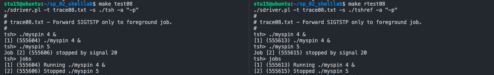

#### Trace 09
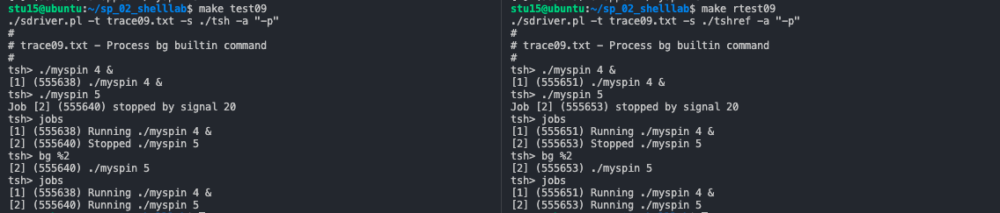

#### Trace 10
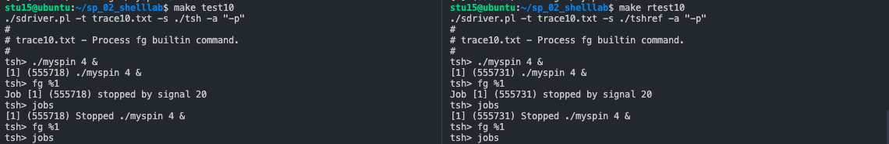

#### Trace 11
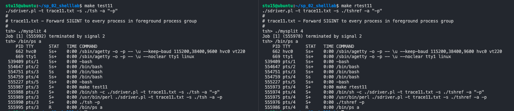

#### Trace 12
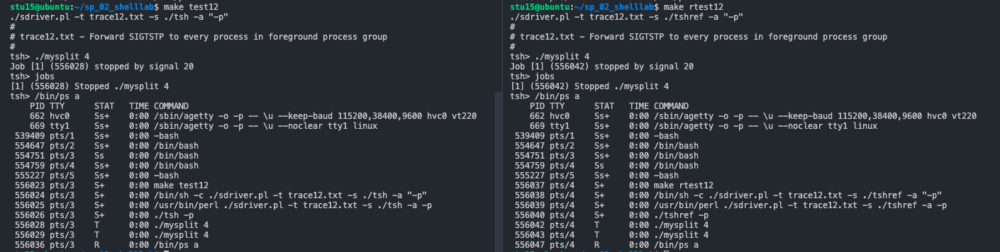

#### Trace 13
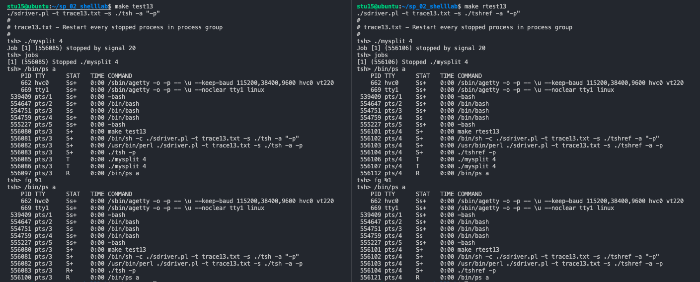

#### Trace 14
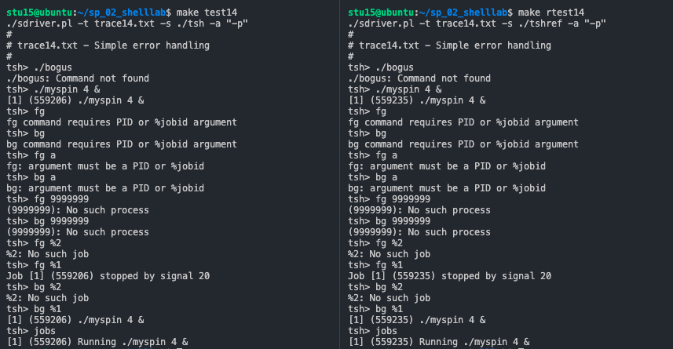

#### Trace 15
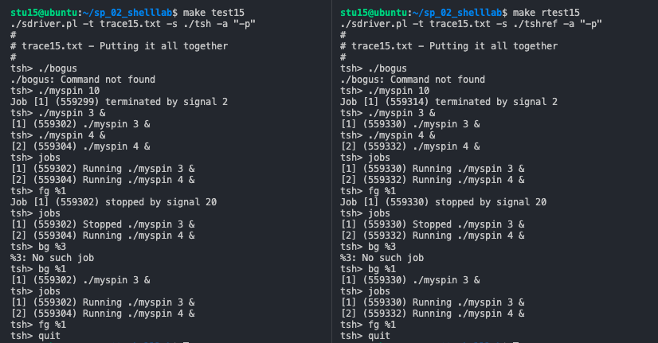

#### Trace 16
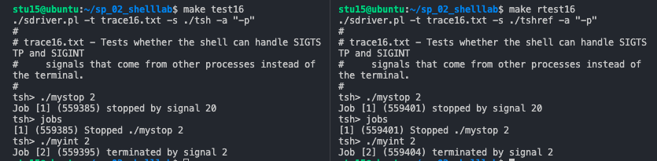

---

### How to Implement Each Function
#### `void eval(char *cmdline)`
- 우선 스켈레톤 코드로 주어진 `parseline()` 함수를 이용하여 argument list `argv` 배열을 채운다. 이 때, `argv` 배열의 크기는 스켈레톤 코드에 선언되어있던 `MAXARGS`이다.
  - `parseline()`함수의 리턴값은 주어진 현재 주어진 명령어가 background에서 돌아갈지 여부(`cmdline`이 `&`로 끝나면 background process로 돌아가야 한다)를 표시해주는 bool(int) 값이기 때문에 해당 값을 `is_bg_cmd`라는 bool(int) 변수로 저장한다.
  - 만일 `parseline()`을 실행한 후 첫번째 argument가 `NULL`, 즉 아무런 입력도 들어오지 않았다는 것이 확인될 경우 `eval()`은 즉시 return을 한다.
- 그 다음 `builtin_cmd()`를 실행하여, 입력으로 들어온 `cmdline`이 built-in command가 아닐 경우에 대해서만 따로 eval을 해준다.
  - `builtin_cmd()`의 리턴값이 1일 경우 `cmdline`이 built-in command이며 해당 명령을 `builtin_cmd()`에서 따로 즉시 처리를 해준다는 의미이기 때문에, 별도의 처리 없이 즉시 return한다.
  - 만약 리턴값이 0일 경우 fork하여 생성된 child process의 context에서 해당 명령을 실행해야 한다.
- 과제 안내와 같이, race condition을 피해 정상적으로 실행을 하기 위해서는 `fork()` 이전에 signal blocking을, `fork()` 이후 unblocking과 process group ID 설정을 별도로 해주어야 한다. 
  - `fork()`를 하기 이전, `sigemptyset()`로 initialize한 signal set `mask`에 `sigaddset()`함수를 이용 `tsh`에서 따로 처리해줄 `SIGCHLD`, `SIGINT`, 그리고 `SIGTSTP` signal들을 추가한다.
  - `sigprocmask()` 함수를 이용하여 위 세 개의 signal이 block된 상태를 만들어준 후 `fork()` 실행하여 리턴값을 `pid`에 저장한다.
  - 이 때, 모든 system call은 후술할 `ret_check()` 함수를 이용해 그 리턴값을 확인하고, 오류가 있을 시 `unix_error()` 함수를 이용해 오류메세지를 출력한다.
- `fork()`가 정상적으로 되었을 경우, child process에 한해, 즉 `pid`가 `0`인 경우에 대해 `execve()`를 실행해 명령어대로 실행해준다.
  - 이 때, 유저가 `ctrl+c` 입력 시 background에 있는 child process가 `SIGINT` signal을 받지 않도록 `setpgid(0, 0)`을 실행하여 고유한 process group ID를 가질 수 있도록 한다.
  - 또한, `execve()`가 실행되기 전에 기존의 상태로 signal을 unblock한다.
  - `execve()`는 정상적으로 실행되었을 경우 리턴을 하지 않고, 오류가 있을 경우에만 리턴을 하기 때문에 해당 경우에 한해 오류 메시지를 출력하고 종료 (i.e. `exit(1)`)하도록 한다.
- parent process일 경우, 즉 `if (!pid)`에 해당되지 않을 경우 주어진 `addjob()`을 이용해 job list에 job을 추가하고, 마찬가지로 signal을 unblock한다.
  - 이 때, `parseline()`을 통해 얻은 `is_bg_cmd` 값에 따라 job state 인자를 다르게 넘겨줘야 한다.
  - 또한, background일 경우 후술할 `print_job_info()` 함수를 이용하여 job에 대한 정보를 출력하고, foreground job일 경우 `waitfg()` 함수를 이용하여 foreground process가 끝날 때까지 기다렸다가 리턴을 한다.

#### `buildtin_cmd(char **argv)`
- `argv`를 전달 받아 `cmdline`으로 들어온 명령이 Tiny Shell의 built-in command인지 여부를 확인한다.
  - Tiny Shell의 built-in command에는 `quit`, `fg`, `bg`, 그리고 `jobs`, 이렇게 총 네 가지가 있다.
  - `strcmp()` 함수를 이용하여 `name` 변수로 저장된 `argv[0]` 값이 built-in command와 일치하는지 확인한 후, 일치하지 않으면 `0`을 즉시 리턴하고, 일치하면 필요한 동작을 즉시 실행한 후 `1`을 리턴한다.
  - 각 built-in command에 대해 실행해야 하는 동작은 다음과 같다:
    - `quit`의 경우 별다른 처리 없이 `exit(0)`을 한다.
    - `fg`나 `bg`의 경우 `do_bgfg()` 함수에서 처리를 해준다.
    - `jobs`의 경우 주어진 `listjobs()` 함수를 call하면 된다.
    - 위 세 가지 경우에 해당되지 않으면 built-in command가 아니므로 0을 리턴한다.

#### `void do_bgfg(char **argv)`
- 우선, `bg`나 `fg` 명령어의 경우 어떤 프로세스를 대상으로 주어진 명령을 실행할지 알아야 하기 때문에 두번째 인자에 해당하는 `argv[1]` 값이 필수적이다. 따라서 `argv[1]` 값이 없을 경우 에러 메시지를 출력한 후 즉시 리턴한다.
- 그 다음 `argv[1]`을 jid 혹은 pid 값으로 parsing을 해야하는데, 정상적으로 parsing이 가능한 경우는 두 가지이다.
  - 1. jid의 경우 `%` 심볼로 시작을 하기 때문에 `%`로 시작하면서 `%`를 제외한 나머지가 정수로 정상적으로 변환이 가능해야 한다.
  - 2. pid의 경우 string 전체가 정수로 변환이 가능해야 한다.
  - 위 두 가지를 판별하기 위해 `atoi()` 함수를 사용하는데, 이 함수의 경우 제대로 변환이 되면 변환된 `int`값을, 그렇지 않으면 `0`을 리턴한다. `nextjid` 값이 1에서부터 시작하도록 되어있어 jid가 0이 될 수 없고, pid 또한 마찬가지이기 때문에 `atoi()`의 리턴값에 따라 변환 여부를 판단하는 것이 가능하다.
  - 위 두 가지 경우에 해당이 되지 않으면 argument가 PID 혹은 jobid여야 한다는 메시지를 출력 후 리턴한다. (main if statement의 `else` case에 해당)
- jid나 pid가 잘 parsing이 되었으면, 해당 jid나 pid를 가진 job가 존재하는지를 `getjobjid()`와 `getjobpid()` 함수의 리턴값을 통해 판단한다.
  - 만일 job이 없으면 에러 메시지를 출력한 후 리턴한다.
  - job이 있을 경우 해당 job의 pid를 구해 (<-- jid가 주어진 경우에만 해당) `kill()` 함수를 이용해 `SIGCONT` signal을 전달한다.
  - 그리고 `fg` 혹은 `bg` 명령인지에 따라 job의 state를 변경해주고, `eval()`에서와 마찬가지로 `waitfg()`로 foreground process를 기다리거나 job info를 출력한다.

#### `void waitfg(pid_t pid)`
- 과제 안내에서 힌트가 주어진 바와 같이, `sleep()` 함수를 이용하여 foreground job이 끝날 때까지 기다린다.
- foreground job의 종료시점은 `fgpid()` 함수의 리턴값, 즉 foreground에서 돌아가고 있는 프로세스의 pid가 `waitfg()`의 인자로 주어진 pid와 동일한지 비교를 통해 판단할 수 있다.

#### `void sigchld_handler(int sig)`
- 여러 child process로부터 동일한 signal을 받았을 경우에도 정상적으로 처리하기 위해 `waitpid(-1, ...)`를 실행하여 모든 child process를 처리해준다.
  - 이 때, `SIGTSTP` signal이 전달되었을 때도 처리를 해주기 위해 `WUNTRACED` 옵션을 줘야 하고, child process가 없을 경우 굳이 기다리지 않도록 `WNOHANG` 옵션 또한 전달한다. 
  - 이와 같은 맥락에서, `errno`가 `ECHILD`, 즉 'The calling process has no existing unwaited-for child processes.'라는 에러를 받았을 경우 에러를 무시하고 나머지 경우에 대해서만 `waitpid()`가 제대로 이루어졌는지 `ret_check()`를 통해 확인해준다.
- `waitpid()` 실행 후 리턴값으로 돌아오는 terminated child process의 pid를 `getjobpid()`에 전달해 해당되는 job을 찾는다.
  - stop signal로 잠시 멈춘게 아닌 경우 `deletejob()` 함수를 이용하여 job을 삭제한다.
  - 만일 stop이 된 상태라면, 해당 job의 state를 `ST`로 변경해준다.
  - 정상적으로 terminate를 한게 아닐 경우 `print_signal_info()` 함수에 job을 전달하여 tshref와 동일한 방식으로 메세지를 출력한다.

#### `void sigint_handler(int sig)`
- 비교적 간단한 함수인데, `fgpid()` 함수를 이용하여 foreground job의 pid를 찾은 후, `kill()` 함수를 이용해 `SIGINT` signal을 전달해준다.
  - 이 때, 해당 pid의 전체 foreground process group으로 signal을 전달하기 위해 `pid`가 아닌 `-pid`로 인자를 전달한다.
  - `kill()`이 제대로 되었는지 `ret_check()`로 확인한다.

#### `void sigtstp_handler(int sig)`
- `void sigint_handler(int sig)`와 유사한 방식으로 동작하는 함수로, fgpid()` 함수를 이용하여 foreground job의 pid를 찾은 후, `kill()` 함수를 이용해 `SIGTSTP` signal을 전달해준다.
  - 이 때, 해당 pid의 전체 foreground process group으로 signal을 전달하기 위해 `pid`가 아닌 `-pid`로 인자를 전달한다.
  - `kill()`이 제대로 되었는지 `ret_check()`로 확인한다.

#### `int ret_check(int ret, char *msg)`
- `kill()`, `sigemptyset()`, `sigprocmask()`, `sigaddset()`, `waitpid()`, `setpgid()`, 등 많은 system call을 요하는 함수는 에러 발생 시 음수 (-1) 값을 리턴한다.
- 따라서 해당 함수들을 첫번째 인자인 `int ret`로 전달하여 리턴값을 evaluate하고, 해당 값이 음수일 경우 `unix_error()` 함수로 두번째 인자에 해당하는 `char *msg`를 전달하여 에러 메시지를 출력한 후 `exit(1)`하도록 한다.
- 만약 리턴값이 음수가 아닐 경우, 즉 에러가 발생하지 않았을 경우 `int ret`로 전달되었던 함수의 리턴값을 그대로 다시 전달해준다.

#### `void print_job_info(struct job_t *job)`
- `struct job_t *` 타입의 인자를 전달받아 해당 job의 jid, pid, 그리고 cmdline 정보를 가지고 job info를 출력해준다. 
- background job을 알리기 위해 사용된다.

#### `void print_signal_info(struct job_t *job, char *msg)`
- `print_job_info()`와 유사한데, `sigchld_handler()`에서 정상적으로 terminate된 경우가 아닌 경우들에 대해 어떤 signal때문에 어떤 동작이 발생했는지를 출력해주기 위해 사용된다.

---

### What was Difficult
- 왜인지 모르게 job의 개념을 이해하는 데에 굉장히 오래 걸렸다. Process와 job의 차이가 명확히 이해되지 않았는데, 검색을 하다 보니 process와 job이 동일 선상에 놓고 비교했을 때 그 차이가 매우 분명하다기 보다 사용되는 맥락이나 차원 자체가 다르다는 점을 알 수 있었다. 이 점을 이해한 뒤에 스켈레톤 코드를 살펴보니 기존에 수업 시간에 배웠던 process 중심의 개념들과 코드가 이번 프로젝트의 어느 부분에 적용되는 것인지, 그리고 job이라는 개념은 어디서 어떻게 쓰이는지 훨씬 더 명확히 이해할 수 있었다.
- 처음에 엉뚱하게도 안내문 3페이지에 제시된 `argc == 3` 등의 내용이 예시인줄 모르고 `argc` 값이 3으로 국한되어야 하는 것으로 이해해서 과제 안내 자체에 대한 혼란을 겪었다. 프로젝트를 완성한 시점에서 생각해보니 `/bin/ls`가 단순히 평소 자주 사용하던 `ls` command를 UNIX 특유의 file 중심의 방식으로 command를 전달하는 것이라는 사실을 잊은 채로 주의 깊게 읽지 않아 생겼던 실수였던 것 같다.
- 사실 과제 안내에 힌트가 너무 많아서 잘 모르고도 구현을 하게 되는 느낌이 없지 않아 있었다. 특히 `waitfg()`와 sigchld handler 간의 구분이라던지, `eval()`에서 `SIGINT`와 `SIGTSTP`도 blocking을 해줘야 한다는 사실이라던지, blocking/unblocking을 하는 시점이라던지, 힌트가 있기에 구현이 가능했다고 느껴지는 부분들이 있었다.
 
### What was Surprising
- 프로그래밍연습 수업에서 처음 C 프로그래밍을 접하고 그 뒤로 C 프로그래밍을 한 적이 없었는데, C에 이렇게 많은 라이브러리와 함수들이 있는 줄 몰랐다. 그리고 이번에 활용하게 되었던 signal 관련된 함수들을 보니 왜 low level을 다뤄야 하는 경우 C 언어를 사용하게 되는 것인지 보다 분명하게 이해할 수 있었다.
- ref로 주어진 tsh와 과제로 구현한 tsh가 동일하게 작동하는지 확인하기 위해 `diff <(cmdline 1) <(cmdline 2)` 형태의 명령을 처음으로 사용해보게 되어 신기했다.
- 과제 안내에 제시된 line 수를 보다 보니 평소에 얼마나 주석을 적게 달고 대충 코드를 작성했었는지 확연하게 드러났다. 주석을 꼼꼼하게 작성하다 보니 line 수도 훨씬 늘어나고 스스로도 코드의 구석구석에 대해 좀 더 꼼꼼하게, 그리고 명확하게 이해한채로 구현을 할 수 있었던 것 같다.

